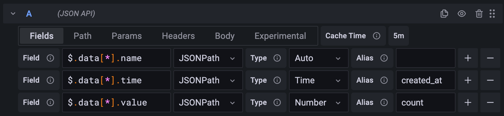
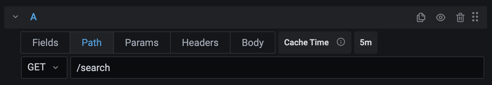
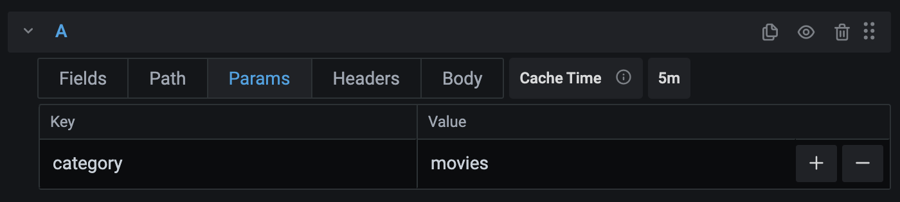
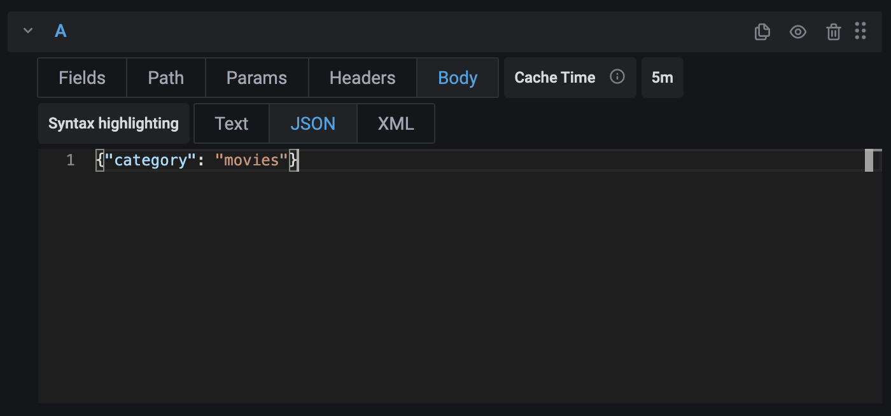

This page explains the what each part of the query editor does, and how you can configure it.

The query editor for the JSON API data source consists of a number of tabs. Each tab configures a part of the query.

### Fields



The **Fields** tab is where you select the data to extract from the JSON document returned by the URL configured in the data source configuration.

- **Field** must contain a valid [JSONPath](./jsonpath.md) expression and can return one or more elements.
- **Type** defines the JSON type of the elements returned by the **Field** expression. By default, Grafana uses the types in the JSON document. If **Type** is set to a different type than the original property type, Grafana tries to parse the value.

  This can be useful in cases where the API returns quoted numbers, e.g. `"price": "3.49"`.

#### `Fields have different lengths`

All fields must return the same number of values. If you get this error it means that one or more of the objects are missing the queried element.

In the following example, the `name` property is present in both objects, but `version` isn't.

```json
{
  "services": [
    {
      "name": "order-api",
      "version": "1"
    },
    {
      "name": "billing-api"
    }
  ]
}
```

In the example below, you can see a couple of expressions and their results for the JSON structure in the previous example. Since JSONPath expressions are evaluated individually, Grafana can't tell which version that was missing.

| Expression              | Result                         |
|-------------------------|--------------------------------|
| `$.services[*].name`    | `["order-api", "billing-api"]` |
| `$.services[*].version` | `["1"]`                        |

Depending on your use case, you can use a filter expression to only return items that contain a version:

```json
$.services[?(@.version)].name
```

### Path



The drop-down box to the left lets you configure the **HTTP method** of the request sent to the URL and can be set to **GET** and **POST**.

The text box lets you append a path to the URL in the data source configuration. This can be used to dynamically change the request URL using [variables](https://grafana.com/docs/grafana/latest/variables/).

For example, by setting the path to `/movies/${movie}/summary` you can query the summary for any movie without having to change the query itself.

### Params



Add any parameters you'd like to send as part of the query string. For example, the parameters in the screenshot gets encoded as `?category=movies`.

Both the **Key** and **Value** fields support [variables](https://grafana.com/docs/grafana/latest/variables/).

> **Note:** Any query parameters that have been set by the administrator in the data source configuration has higher priority and overrides the parameters set by the query.

### Headers


Add any parameters you'd like to send as HTTP headers.

Both the **Key** and **Value** fields support [variables](https://grafana.com/docs/grafana/latest/variables/).

### Body



Sets the text to send as a request body.

- **Syntax highlighting** sets the active syntax for the editor. This is only for visual purposes and doesn't change the actual request.

> **Note:** Due to limitations in modern browsers, Grafana ignores the request body if the HTTP method is set to GET.

### Cache time

By default, Grafana caches the JSON document returned by the last request to avoid hitting rate limits while configuring your query. Once you're happy with your query, consider setting the cache time to **0s** to disable caching.
